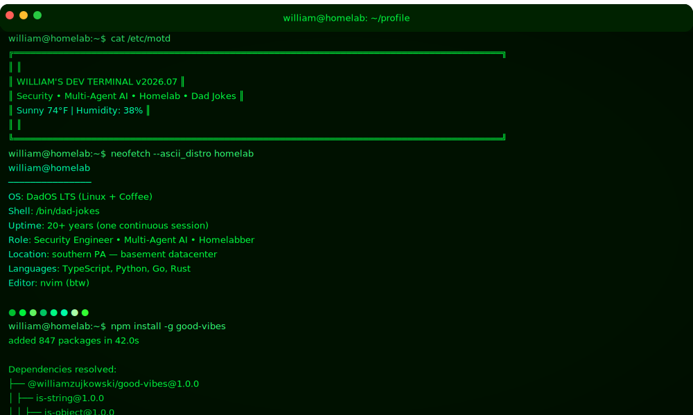

  

  <em>This terminal is <strong>alive</strong> — updates every 6 hours with fresh jokes, live weather, and live GitHub stats.
   Built with <a href="https://github.com/williamzujkowski/svg-terminal">svg-terminal</a> (46 blocks, 8 themes, zero runtime deps). Theme rotates daily.</em>

---

<h2 align="center">Hey, I'm William</h2>

  <strong>Security Engineer</strong> · <strong>AI Systems Builder</strong> · <strong>Homelab Enthusiast</strong> · <strong>Dad Joke Connoisseur</strong>

  Started fixing computers in southern PA in 2005. Twenty years later: 
  enterprise vulnerability management across 100k+ assets, then cloud platform security. 
  Now I build multi-agent AI orchestration, run bare-metal Cloud Foundry in my basement, 
  and collect dad jokes at an alarming rate.

---

### What I'm focused on

- **Multi-agent AI governance** — [nexus-agents](https://github.com/williamzujkowski/nexus-agents) gives AI coding agents the guardrails I wish I had: adversarial review, drift-detected rules, immutable audit, closed-loop telemetry.
- **Security engineering** — Compliance automation, vuln scanning, supply chain. The boring stuff that prevents the exciting stuff.
- **Homelab** — Bare-metal BOSH + Cloud Foundry in the basement. Terraform, Proxmox, a Pi cluster running Docker Swarm. Yes, on purpose.
- **Live-coded music with LLMs** — [live-coding-music-mcp](https://github.com/williamzujkowski/live-coding-music-mcp) hands Claude the keys to Strudel.cc. Apparently the internet liked it.

---

### Featured projects

| Project | Description | |
|:--------|:------------|:--|
| [**live-coding-music-mcp**](https://github.com/williamzujkowski/live-coding-music-mcp) | MCP server giving Claude direct control of Strudel.cc for AI-assisted live coding |  |
| [**standards**](https://github.com/williamzujkowski/standards) | Battle-tested LLM software-development standards — start any project right in 30 seconds |  |
| [**nexus-agents**](https://github.com/williamzujkowski/nexus-agents) | Governance substrate for AI coding agents — adversarial review, drift-detected rules, immutable audit |  |
| [**cognitive-toolworks**](https://github.com/williamzujkowski/cognitive-toolworks) | Generate cross-platform agent artifacts (SKILL.md, AGENTS.md) using LLM intelligence |  |
| [**svg-terminal**](https://github.com/williamzujkowski/svg-terminal) | Generate animated SVG terminals for GitHub READMEs — 46 blocks, 8 themes, deterministic CI builds |  |
| [**mcp-standards-server**](https://github.com/williamzujkowski/mcp-standards-server) | MCP server for NIST 800-53r5 compliance checking and standards enforcement |  |

---

### Stack

The full stack lives on [my site](https://williamzujkowski.github.io) — it changes too often to badge.

---

### From the blog

<!-- BLOG-POST-LIST:START -->
- [Investigating the Trivy Supply Chain Compromise with AI Agents](https://williamzujkowski.github.io/posts/2026-03-21-trivy-supply-chain-compromise-ai-assisted-investigation/)
- [From Paper to Font File: Building an Open-Source Handwriting Digitizer](https://williamzujkowski.github.io/posts/2026-03-09-handwright-paper-to-font/)
- [Building a 3,500-Book Digital Library with Astro and Six APIs](https://williamzujkowski.github.io/posts/2026-02-23-building-tsundoku-digital-bookshelf/)
- [Building Nexus-Agents: What I Learned Creating a Multi-Model AI Orchestration System](https://williamzujkowski.github.io/posts/2026-02-09-building-nexus-agents-multi-model-orchestration/)
- [Consensus Voting With AI Models: When Three Opinions Beat One](https://williamzujkowski.github.io/posts/2026-01-28-consensus-voting-ai-models-multi-agent/)
<!-- BLOG-POST-LIST:END -->

More at [williamzujkowski.github.io](https://williamzujkowski.github.io)

---

  
  
  

  <em>Views are my own. The dad jokes are not.</em>

