<p align="center">
  <em>👆 This terminal is <strong>alive</strong> — updates daily with fresh jokes, real-time stats, and accurate timestamps!</em><br>
  <sub>Built with SVG animations • No JavaScript required • View source to see the magic ✨</sub>
</p>

---

## 🎯 What I Do

**Senior Security Specialist** by day, **Smart Home Architect** by night, **Dad Joke Distributor** 24/7.

I build defensive security automation, over-engineer home networks, and occasionally ship production code that actually works on the first try (citation needed).

<details>
<summary><strong>🛠️ Tech Stack & Tools</strong></summary>

```yaml
languages:
  daily: [Python, JavaScript, Bash, YAML]
  learning: [Rust, Go]

security:
  - NIST 800-53 compliance automation
  - Defensive security tooling
  - Threat detection & response

infrastructure:
  - Home Assistant • ESPHome • Zigbee2MQTT
  - Docker • Kubernetes (homelab)
  - Raspberry Pi cluster magic

current_obsession: "Making SVG animations do things they weren't designed for"
```
</details>

### [🖥️ This Profile](https://github.com/williamzujkowski/williamzujkowski)
Dynamic SVG terminal with daily joke rotation, live stats, and smooth animations

**Stack:** SVG • Node.js • GitHub Actions

</td>
</tr>
</table>

## 💬 Let's Connect

<p align="center">
  <a href="https://github.com/williamzujkowski"></a>
  <a href="https://www.linkedin.com/in/williamzujkowski"></a>
  <a href="https://williamzujkowski.github.io"></a>
</p>

---

<p align="center">
  <em>"Living life one <code>git commit</code> at a time, with family as the <code>main</code> branch."</em>
</p>
